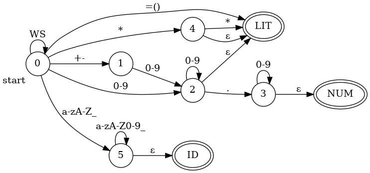

# Lab 7

 # Description
 This lab is the FIRST part of a parser lab.  This week we focus on lexing. 
 Eventually, we will build a parser for a simple language that supports assignments
 ```
      var = expr
 ```
 Typeing an expression by itself will display the value of the expression  

 Tokens:
 - `ID`:  Any letter followed be a sequence of letters and numbers  
 - `NUM`: An optional sign followed by a sequence of digits, optionally with single decimal point.   
 - `LIT`: Any literal symbol  
 - `WS`:  Whitespace (no tokens generated, this is skipped)  

 Grammar:
 ```
      <stmt> ::= <assign> | <expr>
      <assign> ::= ID = <expr> 
      <expr> ::= <term> | <term> + <expr> | <term> - <expr>
      <term> ::= <factor> | <factor> * <term> | <factor> / <term>
      <factor> ::= <base>**<factor> | <base>
      <base> := ID | NUM |  (<expr>)
 ```

The lexer uses a state diagram indicated in this image:

In the image, whenever you move from one state to another you add the character on the edge to the lexeme, and you move to the next character of input. The exceptions are `WS`, which you do not add to the lexeme, and `ε`, which represents "no character" and you only transition on it when no other match is available. It causes no character to be read from the input or added to the lexeme. 

Watch the lecture for a description, I will do the whole lab and you just need to follow along. 

